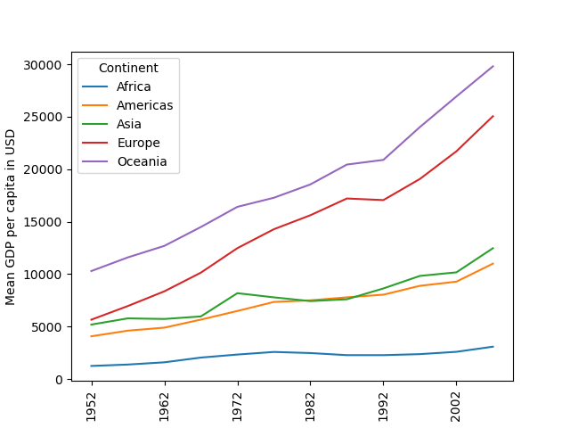
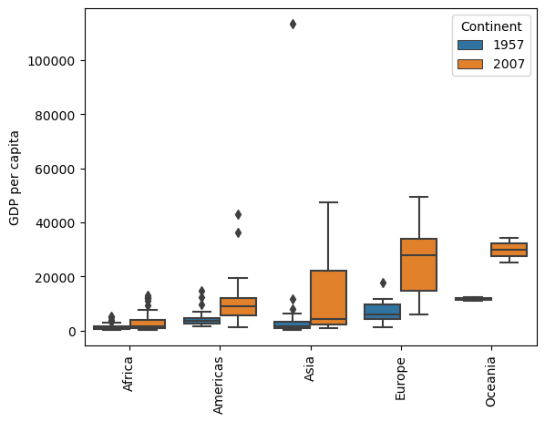

## Example document file

### Introduction

It is common that Python packages or data projects have associated documents, regardless if they are
actual documentation for the code or miscellaneous documents that may include analyses, reports, or 
recorded experiments.

### Results

For the Gapminder package, for example, we could have a scientific paper showcasing the data.
We could present the figures we generated with our package, such as the mean GDP growth by continent:

Or the growth in GDP after 50 years:

We could end our paper with a figure about the state of World Development in the year of 2007:

### Discussion

If we have a Markdown with links to our figures, we may want to compile it, as PDF or HTML, for example.
For that we are going to use an additional script, `knit.py`.